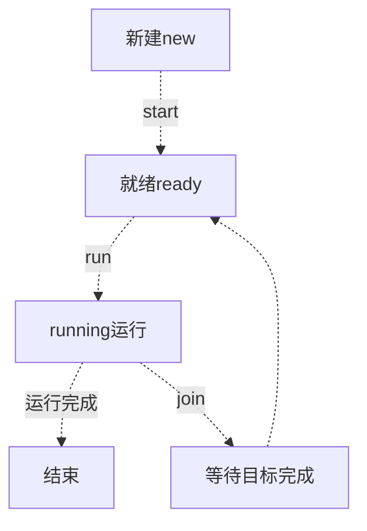

# java notebooks


### 构造函数

尽管可以在构造函数中调用构造函数，但是只可以调用一次，并且构造函数的调用必须排在第一位，否则将会出现编译时错误。

### 变量

类中的变量不用初始化 方法中的局部变量必须初始化

报错:The local variable set may not have been initialized

你确实在for循环中给d2赋值了，但是，循环体并不是一定会执行，如果不执行，d2就没有初始化，而d在for循环外就被赋值了，所以，编译器要求你初始化d2。

初始化方法

```java
  Set<String> testSet = new HashSet<String>();
List<Integer> arr = new ArrayList<Integer>();
```

   Set<Integer> set = new Set<Integer>();是不行的


offer，add区别：
一些队列有大小限制，因此如果想在一个满的队列中加入一个新项，多出的项就会被拒绝。
这时新的 offer 方法就可以起作用了。它不是对调用 add() 方法抛出一个 unchecked 异常，而只是得到由 offer() 返回的 false。 

poll，remove区别：
remove() 和 poll() 方法都是从队列中删除第一个元素。remove() 的行为与 Collection 接口的版本相似，
但是新的 poll() 方法在用空集合调用时不是抛出异常，只是返回 null。因此新的方法更适合容易出现异常条件的情况。
peek，element区别：
element() 和 peek() 用于在队列的头部查询元素。与 remove() 方法类似，在队列为空时， element() 抛出一个异常，而 peek() 返回 null
LinkedList与ArrayList最大的区别是LinkedList更加灵活，并且部分方法的效率比ArrayList对应方法的效率要高很多，
对于数据频繁出入的情况下，并且要求操作要足够灵活，建议使用LinkedList；
对于数组变动不大，主要是用来查询的情况下，可以使用ArrayList。

10月28日
从别人的服务器
接收html文件
然后用浏览器解析.
JSP全称Java Server Pages，是一种动态网页开发技术。它使用JSP标签在HTML网页中插入Java代码
https://www.runoob.com/jsp/eclipse-jsp.html

输入管道
DataInputStream(new buffer(new filestream)) 
输出管道

main

implement  是给编译器看的,证明他有这个能力. 运行的时候不看.
构造函数可以传入一个类.

构造函数 可以new(this).


extend JFrame

stu = new JTextField();

super( "计算器2020");//父类的构造方法.


### String 的用法

java 中String是 immutable的，也就是不可变，一旦初始化，引用指向的内容是不可变的（注意：是内容不可变）。

　　也就是说，假设代码中有String str = “aa”;str=“bb”;，则第二条语句不是改变“aa”原来所在存储地址中的内容，而是另外开辟了一个空间用来存储“bb”；同时由于str原来指向的“aa”现在已经不可达，jvm会通过GC自动回收。

 

　　在方法调用时，String类型和数组属于引用传递，在上述代码中，str作为参数传进change(String str, char ch[]) 方法，方法参数str指向了类中str指向的字符串，但str= "test ok"; 语句使得方法参数str指向了新分配的地址，该地址存储“test ok”，而原来的str仍然指向“good”。对于数组而言，在change方法中，方法参数ch指向了类中ch指向的数组，ch[0] = 'g';语句改变了类中ch指向的数组的内容


你给他函数传入str, 函数里   str = "test ok"; 或者str = str.toUpperCase();   ch = new char[]{ 'm', 'n' };都是不会变的

根据JDK中java.lang.String的源码进行分析，从中可以得出String类型的对象不可变的原因，大致上有如下两个：

　　1、java.lang.String类型在实现时，其内部成员变量全部使用final来修饰，保证成员变量的引用值只能通过构造函数来修改；

　　2、java.lang.String类型在实现时，在外部可能修改其内部存储值的函数实现中，返回时一律构造新的String对象或者新的byte数组或者char数组；

仅凭第1点还不能保证其不可变特性：假如通过String类型的toCharArray方法可以直接访问String类型内部定义的char数组，那么即便String类型内部的char数组使用了final来修饰，也仅仅保证这个成员变量的引用不可变，而无法保证引用指向的内存区域不可变。

第2点保证了外部不可能修改java.lang.String类型对象的内部属性，从而保证String对象是不可变的。

```
public static void main(String[] args) {
        String s1="abc"+"def";
        String s2=new String(s1);
    }
```

上述代码中，s1与s2指向不同的对象，但是两个对象的内容却是一样的，故“s1==s2”为假，s1.equals(s2)为真。

（1）"=="操作符的作用

　　　　A、用于基本数据类型的比较

　　　　B、判断引用是否指向堆内存的同一块地址

　　（2）equals的作用

　　　　用于判断两个变量是否是对同一个对象的引用，即堆中的内容是否相同，返回值为布尔类型

```java
 String s1 = new String("java");
        String s2 = s1;

        System.out.println(s1==s2);
        System.out.println(s1.equals(s2));
```

解说：如果理解了前面那个例子的运行情况，那么这个就是一目了然的事情，此处s1与s2指向同一个对象，"=="操作符的作用之一就是判断引用是否指向堆内存的同一块地址，equals的作用是判断两个变量是否是对同一个对象的引用（即堆中的内容是否相同），故此处均输出“true”

#### 将**字符数组**转换为字符串

```java
    char[] data = {'a', 'b', 'c'};
//      String str = new String(data);
        String str = String.valueOf(data);
        System.out.println(str);
```

【Java】数组不能通过toString方法转为字符串  http://www.cnblogs.com/ningvsban/p/3955483.html

将**字符串数组**转换为字符串

```java
  String[] ary = {"abc", "123", "45"};
        String s = "";
        for(String temp : ary) {
            s=s.concat(temp);//和下面的一行二选一即可
//          s += temp;
        }
//或者
       String[] ary = {"abc", "123", "45"};
        StringBuilder sb = new StringBuilder();
        for(int i = 0; i < ary.length; i++){
            sb. append(ary[i]);
        }
        String newStr = sb.toString();
```

在编写java代码的过程中有时要频繁地对字符串进行拼接，如果直接用“+”拼接的话会建立很多的String型对象，严重的话会对服务器资源和性能造成不小的影响；而使用StringBuilder和StringBuffer能解决以上问题。根据注释，StringBuffer可谓老资格了，从JDK1.0时即伴随Java征战世界，而StringBuilder直到JDK1.5时才出现。面试时，StringBuffer和StringBuilder的区别也是常问的话题，StringBuffer是线程安全的，而StringBuilder不是线程安全的。

**一、StringBuffer和StringBuilder的共同点：**

1、用来完成字符串拼接操作；

2、都是可变对象，对象内的字符缓存会随着拼接操作而动态扩展；

3、构造时传入内部缓存大小时，可以降低缓存扩展的次数，明显提升字符串拼接操作的效率；

**二、StringBuffer和StringBuilder的区别：**

1、StringBuilder的方法都是线程不安全的，从另外一个角度讲，StringBuilder类型的对象在做字符串拼接操作时，由于少了线程同步的操作，执行效率上有很大提升；

2、StringBuffer的方法都加上了synchronized关键字，因而在一定的场景下，StringBuffer类型的对象都是线程安全的，但在执行效率上，由于多了线程同步的操作，因而会有少许的损失；

在大多数场景下，字符串拼接操作都是不需要考虑多线程环境下对结果的影响的，因而使用StringBuilder类型可以提升代码的执行效率。

在多个线程的代码中共享同一个StringBuffer类型的对象时，需要关注synchronized关键字对最终结果的影响。由于StringBuffer类的实现中，仅仅对每个方法使用了synchronized修饰，这只能保证在多线程场景下，访问StringBuffer对象的同一个方法时可以保证最终结果的一致性，假如一个线程访问A方法，另外一个线程方法B方法，则由于加锁对象的不同，可能会出现不一致的现象，这是需要程序员特别要注意的地方。类似的，可以参考Vector的实现和应用场景。

这里有两篇文章，值得一读：

（1）三分钟理解Java中字符串（String）的存储和赋值原理 http://blog.csdn.net/zhuiwenwen/article/details/12351565

（2）Java之内存分析和String对象 http://www.cnblogs.com/devinzhang/archive/2012/01/25/2329463.html


### 遍历存储类的vector

```java
for(Iterator<FtUser> ite = p.vt.iterator(); ite.hasNext();) 
{
	System.out.println(ite.next().name);
    if (ite.getClass().getName().equals("user10") ) {
					flag = true;//如果有一样的,  那就报告重复, 通知
	}
 }
```
it.next()指向这个类, ite.next().name获得类中的变量

为啥他只能当前的不能现在的.

#### 在流中操作

stream()可以在存储类的collection同时运算, distinct()滤除重复元素.

G7.stream().map( x->x.toUpper()().distinct().collect( )

)

G7.stream().filter

stream()优点

1. 无存储。*stream*不是一种数据结构，它只是某种数据源的一个视图，数据源可以是一个数组，Java容器或I/O channel等。
2. 为函数式编程而生。对*stream*的任何修改都不会修改背后的数据源，比如对*stream*执行过滤操作并不会删除被过滤的元素，而是会产生一个不包含被过滤元素的新*stream*。
3. 惰式执行。*stream*上的操作并不会立即执行，只有等到用户真正需要结果的时候才会执行。
4. 可消费性。*stream*只能被“消费”一次，一旦遍历过就会失效，就像容器的迭代器那样，想要再次遍历必须重新生成。


用()->{} 代替匿名类.

enum 枚举类.


class c = class.forName(servlet);

servlet m = (Servlet) c.newInstance();


### 在map中寻找

get() 

containKey()

 Map.entrySet() 这个方法返回的是一个Set<Map.Entry<K,V>>，Map.Entry 是Map中的一个接口，他的用途是表示一个映射项（里面有Key和Value），而Set<Map.Entry<K,V>>表示一个映射项的Set。Map.Entry里有相应的getKey和getValue方法，即JavaBean，让我们能够从一个项中取出Key和Value。

JavaBean 通过提供符合一致性设计模式的公共方法将内部域暴露成员属性，set和get方法获取。众所周知，属性名称符合这种模式，其他Java 类可以通过自省机制(反射机制)发现和操作这些JavaBean 的属性。

#### java多态

现实中，比如我们按下 F1 键这个动作：

- 如果当前在 Flash 界面下弹出的就是 AS 3 的帮助文档；
- 如果当前在 Word 下弹出的就是 Word 帮助；
- 在 Windows 下弹出的就是 Windows 帮助和支持。

同一个事件发生在不同的对象上会产生不同的结果。

### 多态的优点

- \1. 消除类型之间的耦合关系
- \2. 可替换性
- \3. 可扩充性
- \4. 接口性
- \5. 灵活性
- \6. 简化性

### 多态存在的三个必要条件

- 继承
- 重写
- 父类引用指向子类对象：**Parent p = new Child();**

### 设计模式

#### Adapter 模式

banner是实际情况, 只有交流100V的电压,

printbanner ,继承banner类,实现了需求print接口,

输出直流12V电压,

用处

1. 保证绝对不修改现有的类,只是在外面加一层代码.
2. 版本升级时兼容之前的版本.

**Iterator模式**

写一个自己的iterator

**模板模式 ,**

调用抽象方法, 在父类模板方法中编写了算法. 在实体类中有bug时,不会影响整个算法. 

**工厂模式**  

 有的人把域名反着写,形成独一无二的package name

**singleton 模式:** 

只有一个实例 .

**prototype模式,**

 类中用到了别的类名,就意味着耦合,

**builder模式**

builder声明方法, director 类用builder的抽象方法编写文档,不管哪个txtbuilder还是htmlbuilder传递给director,他都可以工作

**抽象工厂**

有空再看

**bridge模式**

类的功能层次结构和实现层次结构分离两个独立的类层次结构

**strategy 模式**

有空再看

有空再看

有空再看

有空再看

有空再看


### 线程

```java
public static void main(String[] args) {
    Runnable 
}
deposit {
	semaphore.acquire() 或者lock.lock
    做完后
        semaphore .release 或者 unlock
}
```

死锁, 一个获得了object1的锁, , 等待object2的锁,, 另一个获得了 object2的锁,等待obj1的锁

怎么避免死锁? 

资源排序, 确保每个线程都按这个顺序来排序.

一个java进程有多个线程, 共享进程的堆和方法区(有的叫元空间)资源, 每个线程有自己的PC, 虚拟机栈, 本地方法栈.线程是进程划分成的更小的运行单位,一个进程在其执行的过程中可以产生多个线程。线程和进程最大的不同在于基本上各进程是独立的，而各线程则不一定，因为同一进程中的线程极有可能会相互影响。线程执行开销小，但不利于资源的管理和保护；而进程正相反。




